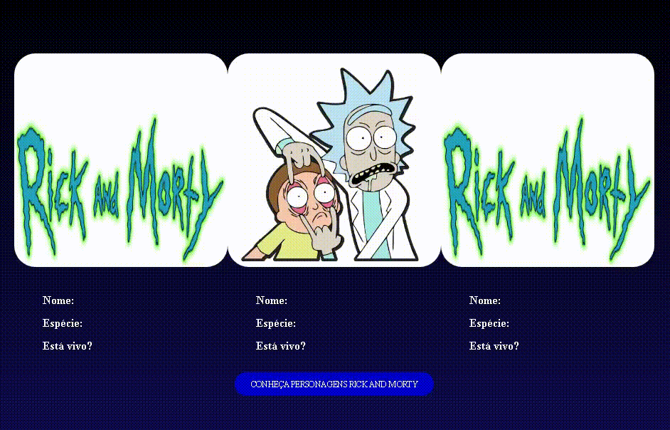

# Desafio - Minicurso Catalisa 2022 ZUP

## 👀 Sobre
Desafio do minicurso do **Programa Catalisa 2022** da **ZUP**.
Usando a base do código feito durante o minicurso para criar uma tela, que exibe aleatoriamente, 3 personagens do desenho **Rick and Morty**, com: **foto, nome, espécie e se está vivo ou morto**.
As informações estão vindo da **API do Rick and Morty**.

---

## 🛠 Tecnologias
- HTML
- CSS
- JavaScript
- Visual Studio Code

---
### 🐱‍🏍 Leandro Costa - "Sempre em busca do conhecimento".
